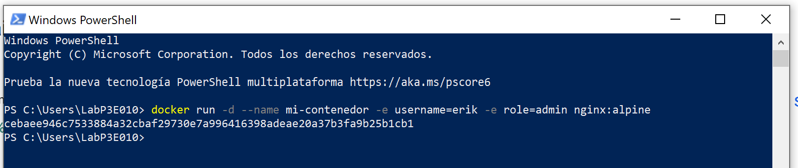

# Variables de Entorno
### ¿Qué son las variables de entorno
*Las variables de entorno son valores que se utilizan en el código de un programa para personalizar su comportamiento y acceder a información relevante. Estas variables se almacenan fuera de la aplicación y pueden afectar su funcionamiento o ser importantes para el mismo. Son utilizadas por el sistema operativo y las aplicaciones para acceder a información relevante y adaptar su comportamiento en consecuencia.*

### Para crear un contenedor con variables de entorno

```
docker run -d --name <nombre contenedor> -e <nombre variable1>=<valor1> -e <nombre variable2>=<valor2>
```

### Crear un contenedor a partir de la imagen de nginx:alpine con las siguientes variables de entorno: username y role. Para la variable de entorno rol asignar el valor admin.
```
docker run -d --name mi-contenedor -e username=erik -e role=admin nginx:alpine
```



### Crear un contenedor con mysql:8 , mapear todos los puertos
```
docker run -p 3306:3306 --name mi_mysql -d mysql:8
```

### ¿El contenedor se está ejecutando?
*No el contenedor no se esta ejecutando*

### Identificar el problema
*El mensaje de error indica que la base de datos no está inicializada y que no se ha especificado la opción de contraseña. Sugiere especificar una de las siguientes variables de entorno: , , o .MYSQL_ROOT_PASSWORDMYSQL_ALLOW_EMPTY_PASSWORDMYSQL_RANDOM_ROOT_PASSWORD*

### Eliminar el contenedor creado con mysql:8 
```
docker rm mi_mysql
```
### Para crear un contenedor con variables de entorno especificadas
- Portabilidad: Las aplicaciones se vuelven más portátiles y pueden ser desplegadas en diferentes entornos (desarrollo, pruebas, producción) simplemente cambiando el archivo de variables de entorno.
- Centralización: Todas las configuraciones importantes se centralizan en un solo lugar, lo que facilita la gestión y auditoría de las configuraciones.
- Consistencia: Asegura que todos los miembros del equipo de desarrollo o los entornos de despliegue utilicen las mismas configuraciones.
- Evitar Exposición en el Código: Mantener variables sensibles como contraseñas, claves API, y tokens fuera del código fuente reduce el riesgo de exposición accidental a través del control de versiones.
- Control de Acceso: Los archivos de variables de entorno pueden ser gestionados con permisos específicos, limitando quién puede ver o modificar la configuración sensible.

Previo a esto es necesario crear el archivo y colocar las variables en un archivo, **.env** se ha convertido en una convención estándar, pero también es posible usar cualquier extensión como **.txt**.
```
docker run -d --name <nombre contenedor> --env-file=<nombreArchivo>.<extensión> <nombre imagen>
```
**Considerar**
Es necesario especificar la ruta absoluta del archivo si este se encuentra en una ubicación diferente a la que estás ejecutando el comando docker run.

### Crear un contenedor con mysql:8 , mapear todos los puertos y configurar las variables de entorno mediante un archivo
# COMPLETAR

# CAPTURA CON LA COMPROBACIÓN DE LA CREACIÓN DE LAS VARIABLES DE ENTORNO DEL CONTENEDOR ANTERIOR 

### ¿Qué bases de datos existen en el contenedor creado?
# COMPLETAR
